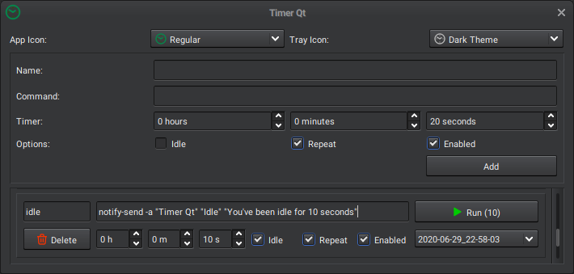

# Timer Qt
A simple Qt app to run commands on a timer.



### Install from source:

- #### Install dependencies:
Debian/Ubuntu: `sudo apt install -y git build-essential qt5-default libkf5idletime-dev`

- #### Clone repo and run install script:
```
git clone https://github.com/slidinghotdog/timerqt.git
cd timerqt
./install.sh
```